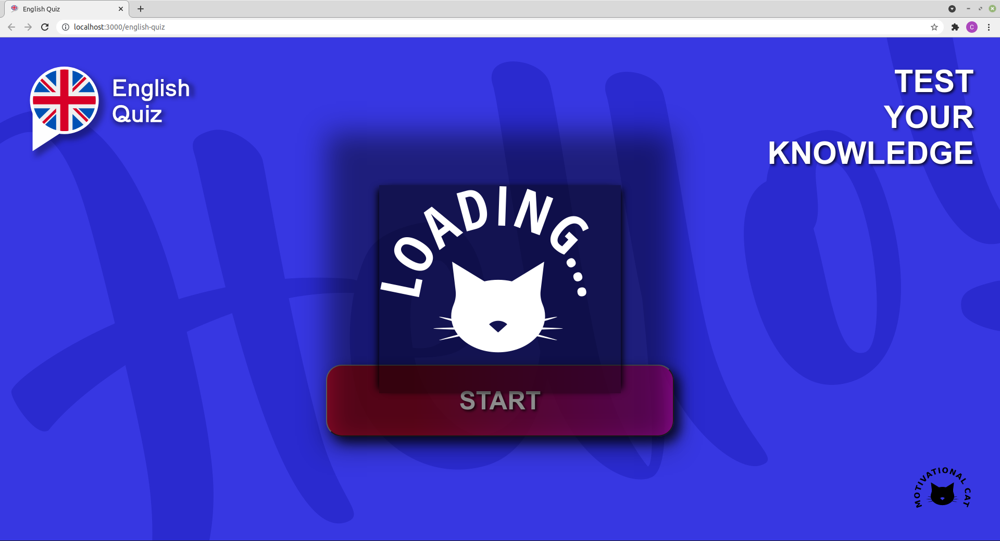
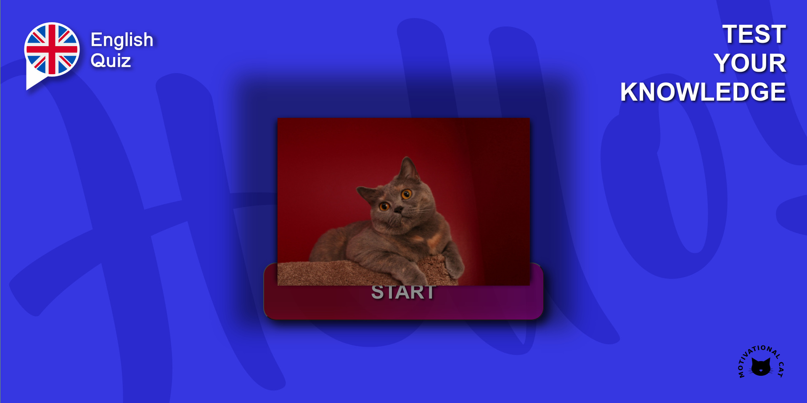
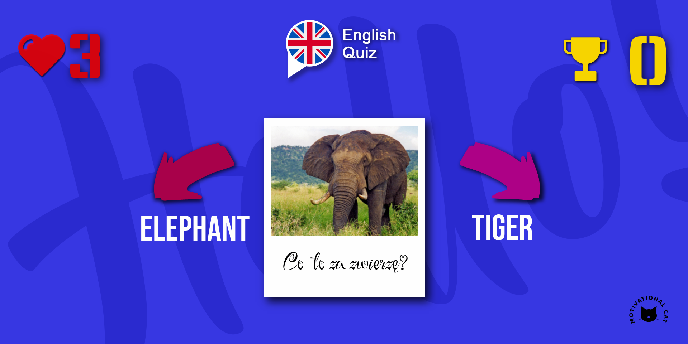

# **English Quiz**

English Quiz is a web application that aims to improve your English language learning. The first stage of work on the project is to program the game as follows: the player must choose the correct answer to the question related to the currently displayed photo. 
He has two hints at his disposal. If the answer is correct, the participant gets a point. 
In case of a wrong answer, he loses one of the three lives received at the start. At any time, the participant can use the "Motivation Cat" button, that displays a random photo of a cat and pauses the quiz. The application is created using React.js, Styled Components and UI of my own project in Figma and Inkscape.

##

##

##

##
## Available Scripts

In the project directory, you can run:

### `npm start`

Runs the app in the development mode.\
Open [http://localhost:3000](http://localhost:3000) to view it in the browser.

The page will reload if you make edits.\
You will also see any lint errors in the console.

### `npm run build`

Builds the app for production to the `build` folder.\
It correctly bundles React in production mode and optimizes the build for the best performance.

The build is minified and the filenames include the hashes.\
Your app is ready to be deployed!

See the section about [deployment](https://facebook.github.io/create-react-app/docs/deployment) for more information.
# **GITHUB PAGES**

You can see the project at this link:

https://wojciechmadeja.github.io/english-quiz/

